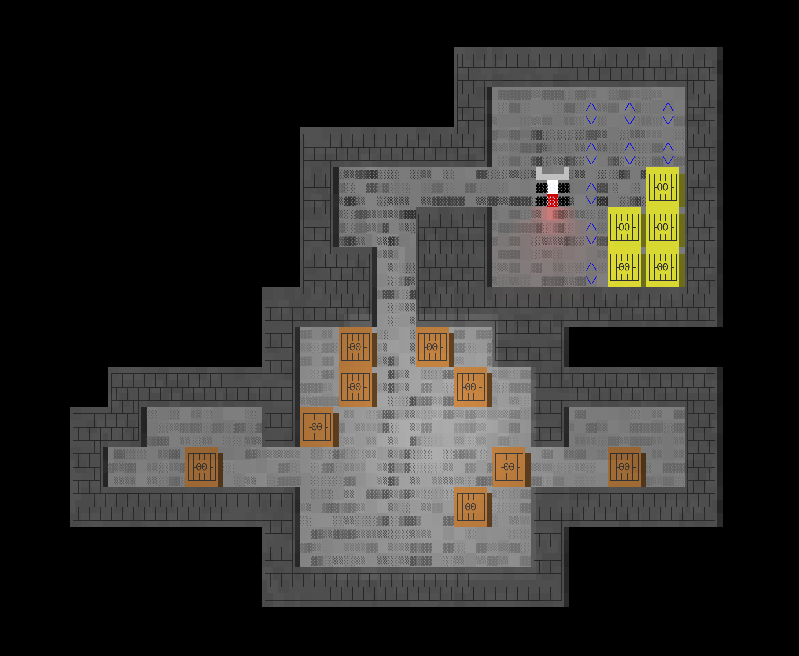

# Sokoban

Sokoban clone for the terminal, featuring nice ANSI graphics with light effects.

## To run the program

The repo doesn't have many external dependecies, but you need to have `node` and `npm` installed.

1. Clone the repo.
2. Run `npm install`.
3. Start with `npm start`.
